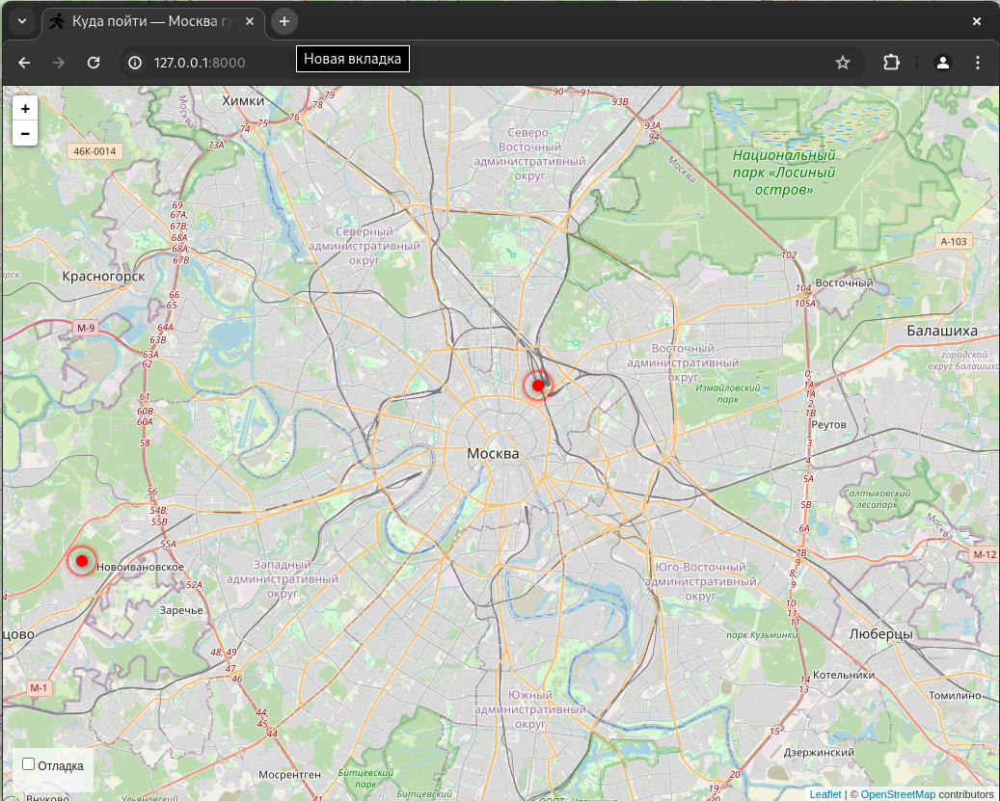
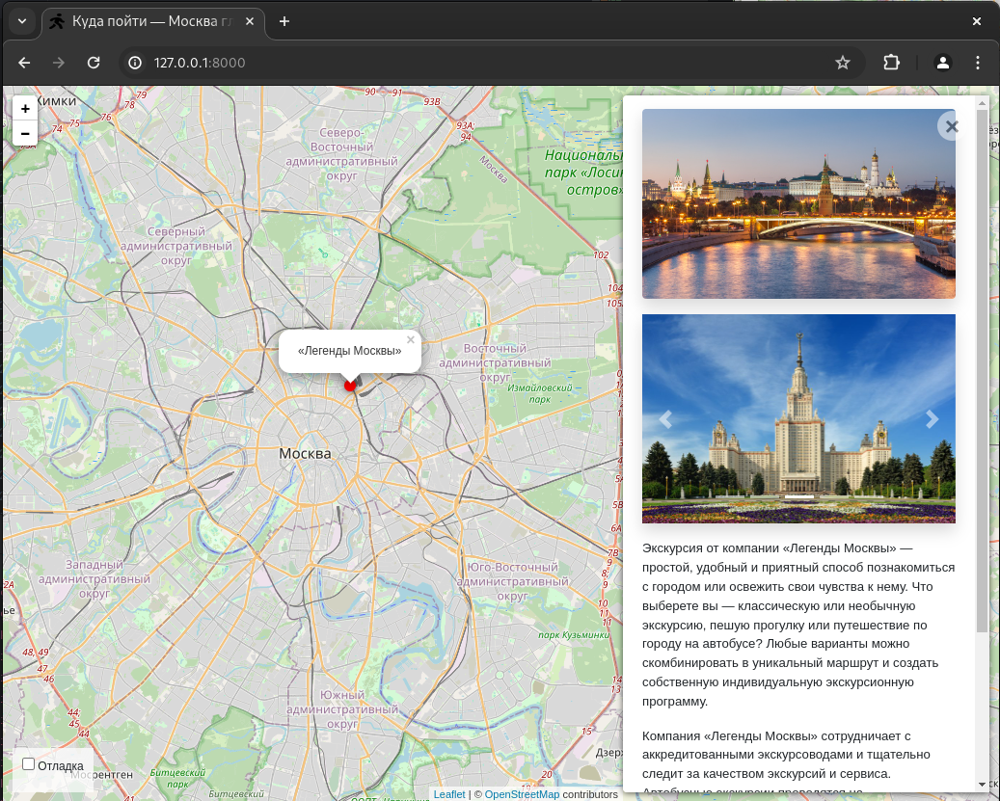
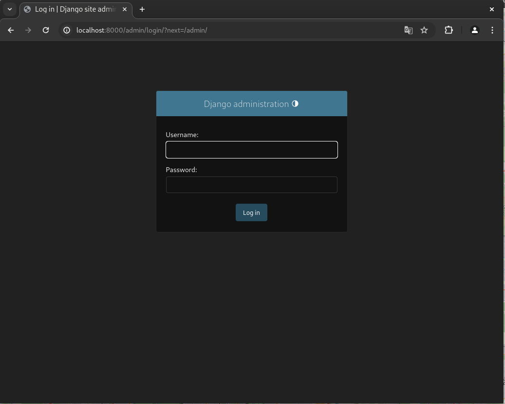
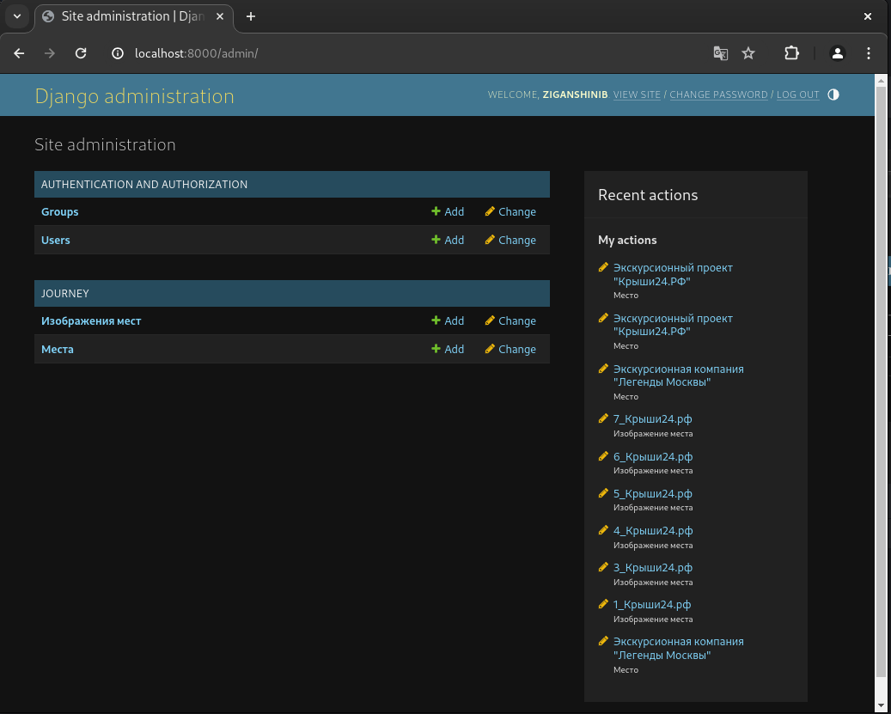

# Проект "Яндекс.Афиша"
https://ziganshinib.pythonanywhere.com/


## Как запустить проект 
* Скачай программу 
```shell
git clone https://github.com/ZiganshinIB/Devman_lesson_1
```
* (Опцианально) Создание виртуланого окружения
```shell
cd ..
python3 -m venv myenv
source myenv/bin/activate
cd mysite
```
* Установка зависимостей
```shell
pip install -r requirements.txt
```
* Редактируй mysite/settings.py
* 1) Введите свой `SECRET_KEY` в файл .env. Инструкция по созданию переменных среды https://help.pythonanywhere.com/pages/environment-variables-for-web-apps/ 
```python
import os
from dotenv import load_dotenv
project_folder = os.path.expanduser('~/learn_python/dvmn_start')  # adjust as appropriate
load_dotenv(os.path.join(project_folder, '.env'))

SECRET_KEY = os.environ['SECRET_KEY_DJANGO']
```
* 2. Добавь свой `ALLOWED_HOSTS`
```python
ALLOWED_HOSTS = ['127.0.0.1', 'localhost', <YOUR_ADDRESS>]
```
* Мигрируте БД
```shell
python3 manage.py migrate
```
* Соберите все статик файлы
```shell
python3 manage.py collectstatic
```
* Запустите проект
```shell
python3 manage.py runserver
```
## Админка 
Для входа в админ панел неоходимо создать супер пользователя
```shell
pyhton3 manage.py createsuperuser
```
Входи в админ панел 
`http://localhost:8000/admin/`



_Данные для демонстрации были взяты `https://github.com/devmanorg/where-to-go-frontend/`_  